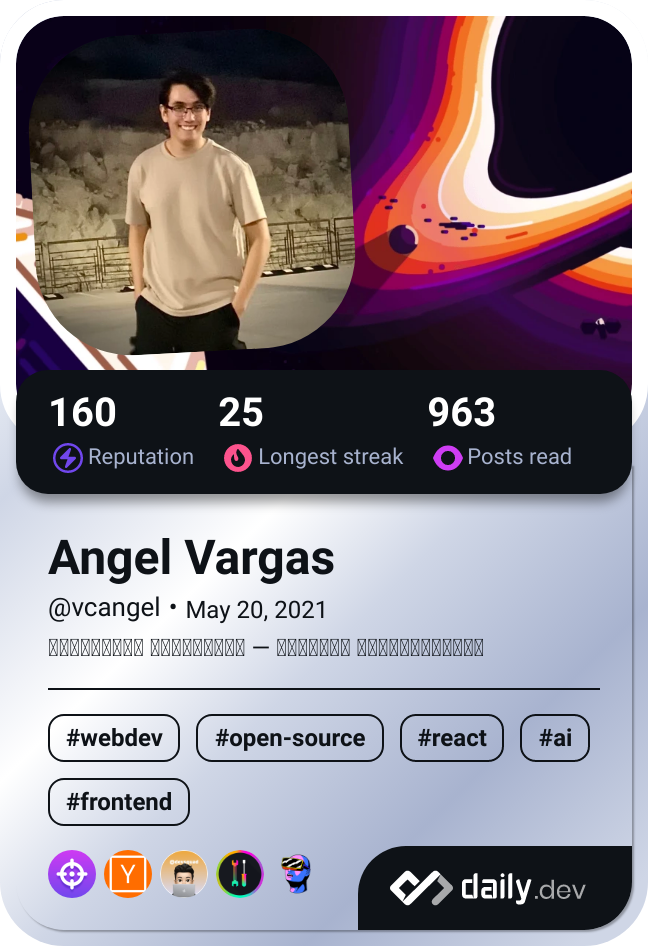

</img>

<div>
<a href="https://app.daily.dev/vcangel">
    
</a>

```shell
> neofetch
```

```yaml
⣇⣿⠘⣿⣿⣿⡿⡿⣟⣟⢟⢟⢝⠵⡝⣿⡿⢂⣼⣿⣷⣌⠩⡫⡻⣝⠹⢿⣿⣷:
⡆⣿⣆⠱⣝⡵⣝⢅⠙⣿⢕⢕⢕⢕⢝⣥⢒⠅⣿⣿⣿⡿⣳⣌⠪⡪⣡⢑⢝⣇:
⡆⣿⣿⣦⠹⣳⣳⣕⢅⠈⢗⢕⢕⢕⢕⢕⢈⢆⠟⠋⠉⠁⠉⠉⠁⠈⠼⢐⢕⢽:    VCAngel@github
⡗⢰⣶⣶⣦⣝⢝⢕⢕⠅⡆⢕⢕⢕⢕⢕⣴⠏⣠⡶⠛⡉⡉⡛⢶⣦⡀⠐⣕⢕:    -----------------------
⡝⡄⢻⢟⣿⣿⣷⣕⣕⣅⣿⣔⣕⣵⣵⣿⣿⢠⣿⢠⣮⡈⣌⠨⠅⠹⣷⡀⢱⢕|    Location: Chihuahua, México
⡝⡵⠟⠈⢀⣀⣀⡀⠉⢿⣿⣿⣿⣿⣿⣿⣿⣼⣿⢈⡋⠴⢿⡟⣡⡇⣿⡇⡀⢕|    OS: Arch Linux
⡝⠁⣠⣾⠟⡉⡉⡉⠻⣦⣻⣿⣿⣿⣿⣿⣿⣿⣿⣧⠸⣿⣦⣥⣿⡇⡿⣰⢗⢄|    Skills: JavaScript, Typescript, HTML 5, CSS 3,
⠁⢰⣿⡏⣴⣌⠈⣌⠡⠈⢻⣿⣿⣿⣿⣿⣿⣿⣿⣿⣿⣬⣉⣉⣁⣄⢖⢕⢕⢕:            Angular, React, Node.js,
⡀⢻⣿⡇⢙⠁⠴⢿⡟⣡⡆⣿⣿⣿⣿⣿⣿⣿⣿⣿⣿⣿⣿⣿⣿⣿⣷⣵⣵⣿:            Python, Java, TailwindCSS
⡻⣄⣻⣿⣌⠘⢿⣷⣥⣿⠇⣿⣿⣿⣿⣿⣿⠛⠻⣿⣿⣿⣿⣿⣿⣿⣿⣿⣿⣿|    Learning: TypeScript, React
⣷⢄⠻⣿⣟⠿⠦⠍⠉⣡⣾⣿⣿⣿⣿⣿⣿⢸⣿⣦⠙⣿⣿⣿⣿⣿⣿⣿⣿⠟|    Interests: GNU/Linux, Rock/Metal, Gaming, Frogs
⡕⡑⣑⣈⣻⢗⢟⢞⢝⣻⣿⣿⣿⣿⣿⣿⣿⠸⣿⠿⠃⣿⣿⣿⣿⣿⣿⡿⠁⣠|    Status: ʰᵉᵃᵈᵃᶜʰᵉ ᵒʷ ᵖᵃⁱⁿ ʰᵉˡᵖ
⡝⡵⡈⢟⢕⢕⢕⢕⣵⣿⣿⣿⣿⣿⣿⣿⣿⣿⣶⣶⣿⣿⣿⣿⣿⠿⠋⣀⣈⠙:
⡝⡵⡕⡀⠑⠳⠿⣿⣿⣿⣿⣿⣿⣿⣿⣿⣿⣿⣿⣿⣿⠿⠛⢉⡠⡲⡫⡪⡪⡣:
```
</div>

[](https://spotify-github-profile.vercel.app/api/view?uid=dedoloco321&redirect=true)
